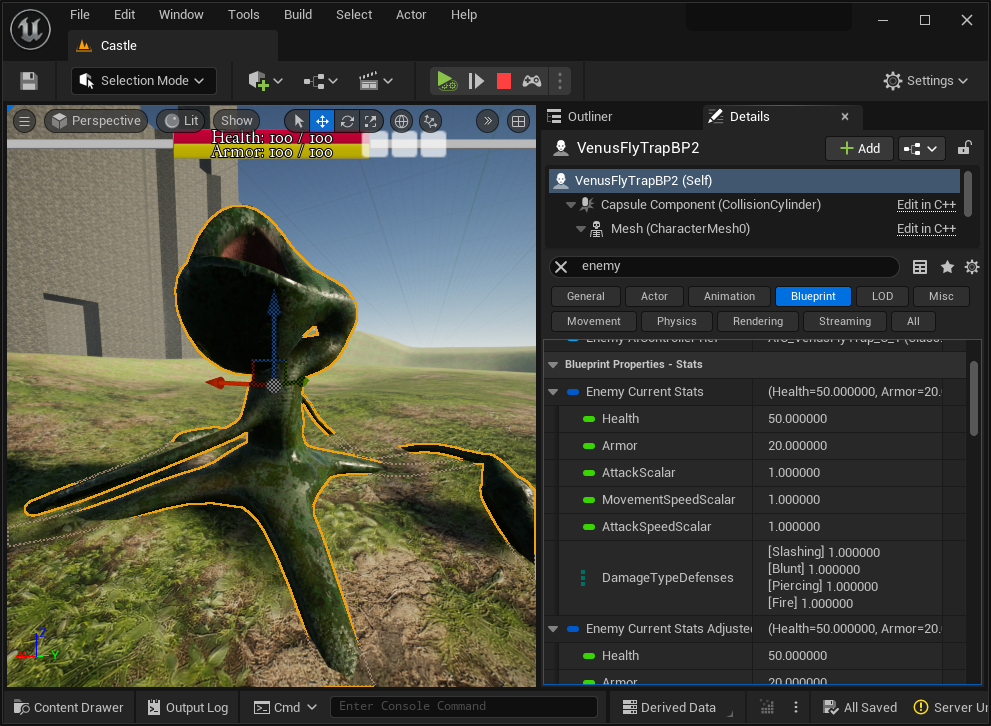

# Live Blueprint Debugger

The Live Blueprint Debugger plugin integrates the Blueprint Debugger's variables window directly into the Level Editor's details panel. When playing or simulating in the editor, a new `Blueprint` section will appear in the details panel for any selected Actor that is an instance of a Blueprint class. All of the Blueprint variables will appear in sections labeled `Blueprint Properties - [category]`, where `[category]` is the category name from the Blueprint Editor.

The above editor screenshot shows filtering for 'enemy' variables. We can see the `Enemy Current Stats` Blueprint struct inside the `Blueprint Properties - Stats` heading, corresponding to the Blueprint variables category `Stats`.

## Features
- Live Blueprint variable data directly in the Actor details panel.
- Fast filtering for specific Blueprint variables.
- When a variable changes, it is highlighted for 1 second in the details panel.

## Differences from the Blueprint Editor's Blueprint Debugger
- Does not expand `UObject` references or variables for faster performance.
- Maximum nested expansion depth is 5 levels.
- Variable values are updated in real time.
- Variable filtering is very fast.
- Does not support breakpoints or show call stacks.

## Settings

The Live Blueprint Debugger settings can be found in `Edit` -> `Project Settings` -> `Plugins` -> `Live Blueprint Debugger`.

### Setting - When to Show Variables

`Only While Playing or Simulating` - Only show the Blueprint section and Blueprint debugger variables when playing or simulating in the editor. This is the default mode.

`Always` - Show the Blueprint section even when not playing or simulating. Note that live variable updates are disabled when not playing or simulating.

### Setting - Highlight Values That Have Changed
Setting this to true will show a one-second highlight animation around a Blueprint variable in the details panel when its value changes.

### Property Refresh Rate

`No Live Updates` - Blueprint variable values will only be updated when first selecting an Actor.

`1Hz` - Blueprint variables will be refreshed 1 time per second.

`10Hz` - Blueprint variables will be refreshed 10 times per second. This is the default mode.

`30Hz` - Blueprint variables will be refreshed 30 times per second.

### Property Changed Highlight Color
This will control the highlight color in the UI when a Blueprint variable value changes if live updates are enabled. The default is green at 60% opacity.

## Notes

The Live Blueprint Editor will create a category for public Blueprint variables under the category `Blueprint Properties - Public`. These variables are also included by default in the details panel under the category `Public`. Only the `Blueprint Properties - Public` category supports live updates, `Public` does not.